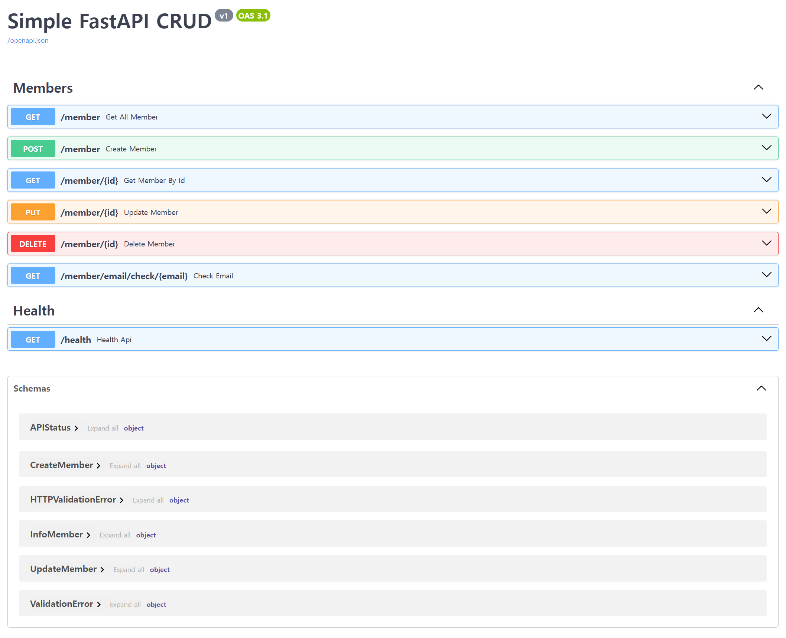

# Simple FastAPI CRUD Example

## 📌 Features

- Python 3.13.x, fastapi~=0.115.12, pydantic~=2.11.5, sqlmodel~=0.0.22
    - PostgreSQL
    - Create an initial user
    - endpoints CRUD
        - member
    - API healthcheck
    - Complete swagger Api info
      - [Swagger](http://localhost:8000/swagger)
        - `http://localhost:8000/swagger`
      - [Redoc](http://localhost:8000/redoc)
        - `http://localhost:8000/redoc`
      - [OpenAPI](http://localhost:8000/openapi.json)
        - `http://localhost:8000/openapi.json`



## 💾 Installation

```bash
# pip 
python -m pip install --upgrade pip
pip install -r requirements.txt

# uv
uv sync
```

## 🔧 Config

- `.env.example`을 복사, 참고 하여 `.env` 파일 작성

## 🏃 Run

```bash
# http
uvicorn app.main:app

# dev 
uvicorn app.main:app --reload

# docker 
docker-compose up --build -d

# db only
docker run -e POSTGRES_PASSWORD=postgres -e POSTGRES_USER=postgres -e POSTGRES_DATABASE=postgres -e -p 5432:5432 --name postgres -d postgres
```